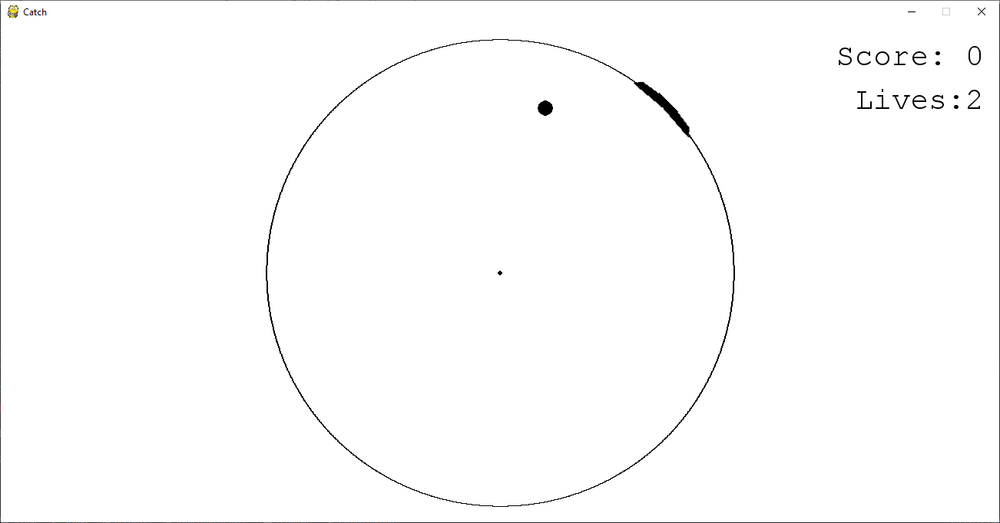
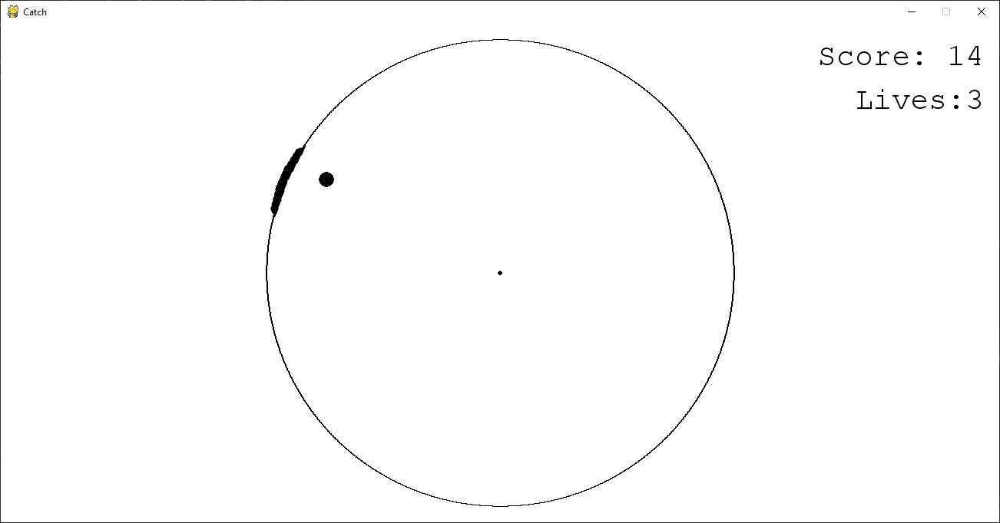
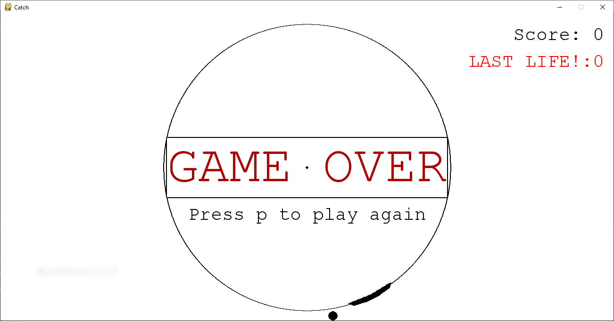

# Catch - A Circular Catching Game
This original game was a final project for my first python class in spring 2017. It was the first non-trivial programming project I ever made. I enjoyed it not just because I made a game, I enjoyed it because the assignment allowed me to create whatever I wanted (as opposed to the other games I've made for assignments like [asteroids](https://github.com/levibaguley/asteroids)). I also enjoyed it because I not only was able to use my brand-new python skills, but I was also to teach myself new things in order to create what I wanted in the game.

### Game Play
The player controls a "mitt" that moves in a circular path. A ball appears in the center of the circle and moves in a random direction. The player must catch the ball before it goes outside of the circle. Every time the ball is caught a point is given and the game speeds up. If the ball is missed and hits the edge of the screen the mitt returns to the bottom of the screen and a life is taken away. The player has 3 lives. If the player loses all of their lives they are given an option to play again. If they choose to do so the game resets and starts over from the beginning.

